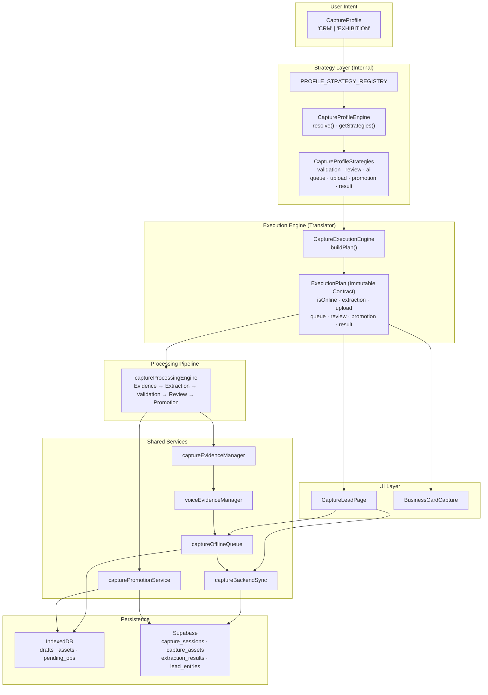

# Capture Domain Architecture

## System Overview

This system is an **offline-first AI-powered lead capture platform** for field sales representatives at trade events. Sales reps capture business contacts through three methods — business card photo, QR code scan, or manual entry — under conditions that routinely include intermittent or absent network connectivity.

The capture domain is the most architecturally complex part of the application. Its design solves a fundamental tension: **different operating contexts require different capture behaviors, but all behaviors must share the same persistence, sync, and evidence infrastructure**. A rep at a quiet one-on-one meeting wants AI extraction results reviewed before saving. A rep at a busy exhibition booth wants to scan cards as fast as possible with processing deferred. Both contexts must work fully offline and sync reliably when connectivity returns.

The architecture resolves this tension through a **Capture Profile system** that separates _user intent_ from _runtime execution_. A profile expresses what the rep wants. The execution engine translates that intent into immutable policies. Shared services execute those policies without ever knowing which profile is active.

---

## High-Level Architecture

---

## Document Structure

| Document | Purpose |
|---|---|
| **README.md** (this file) | System overview, architecture diagram, reading order, document map |
| **architecture-principles.md** | Design philosophy, layer responsibilities, architectural boundaries, invariants — the WHY |
| **architectural-decisions.md** | Architecture Decision Records (ADRs) — context, alternatives, chosen approach, trade-offs |

---

## Reading Order

For a developer joining the project, read in this order:

1. **architecture-principles.md** — Understand the philosophy before touching any code. Pay particular attention to the Architectural Invariants section; violating any invariant breaks the contract.

2. **architectural-decisions.md** — Understand why each major decision was made and what alternatives were rejected. This prevents re-litigating decisions that were deliberately chosen.

3. **README.md** (this file) — Use the architecture diagram as a navigation aid while reading source code.

4. **Source files** — Read in this order: `captureProfile.ts` → `profileStrategies.ts` → `captureProfileEngine.ts` → `CaptureExecutionEngine.ts` → `captureProcessingEngine.ts` → `captureOfflineQueue.ts` → `captureEvidenceManager.ts` → `voiceEvidenceManager.ts` → `capturePromotionService.ts` → `captureBackendSync.ts`.

---

## Scope of These Documents

These documents describe the **capture domain architecture** — the system responsible for creating and syncing leads. They do not cover the lead management UI (LeadsPage, LeadDetailPage), authentication, event management, or the admin dashboard.

The capture domain is located entirely under `src/capture/` with its entry point in `src/CaptureLeadPage.tsx`.

---

## Status

| Profile | Status |
|---|---|
| CRM | Fully implemented. Active in production. |
| EXHIBITION | Strategy bundle not yet registered. `captureProfile.ts` defines the type and descriptor. Implementing it requires only adding a bundle to `PROFILE_STRATEGY_REGISTRY` in `profileStrategies.ts`. |
